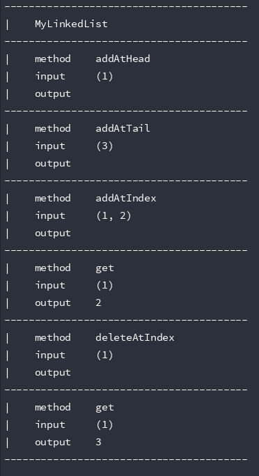

## 记录 LeetCode 的学习
[可视化算法搜索](http://search.shiguopeng.cn)
## 测试
1. `git clone https://github.com/DavidNineRoc/leet-code`
2. `php test.php`
3. 输出如图下

## 题目列表
* [可视化算法](visual)
* 链表
    * 单链表
        * [设计链表](LinkedList/SinglyLinkedList/DesignLinkedList.php)
    * 双指针技巧
        * [环形链表](LinkedList/TwoPointerTechnique/LinkedListCycle.c)
        * [环形链表II](LinkedList/TwoPointerTechnique/LinkedListCycleII.c)
        * [相交链表](LinkedList/TwoPointerTechnique/IntersectionLinkedLists.c)
        * [删除链表的倒数第N个节点](LinkedList/TwoPointerTechnique/RemoveNthNodeFromEndOfList.c)
    * 经典问题
        * [反转链表(迭代)](LinkedList/ClassicProblems/ReverseLinkedList.c)
        * [反转链表(递归)](LinkedList/ClassicProblems/ReverseLinkedListII.c)
        * [奇偶链表](LinkedList/ClassicProblems/OddEvenLinkedList.c)
    * 双链表    
        * [设计链表](LinkedList/DoublyLinkedList/DesignLinkedList.php)
    * 小结
        * [合并两个有序链表](LinkedList/Conclusion/MergeTwoSortedLists.php)
        * [两数相加](LinkedList/Conclusion/AddTwoNumbers.php)
        * [扁平化多级双向链表](LinkedList/Conclusion/FlattenAMultilevelDoublyLinkedList.php)
        * [复制带随机指针的链表](LinkedList/Conclusion/CopyListWithRandomPointer.php)
        * [旋转链表](LinkedList/Conclusion/RotateList.php)
* 队列和栈
    * 队列:先入先出的数据结构    
        * [设计循环队列](QueueAndStack/QueueFirstInFirstOut/DesignCircularQueue.php)
        * [岛屿的个数(DFS)](QueueAndStack/QueueFirstInFirstOut/NumberOfIslands.php)
        * [岛屿的个数(BFS)](QueueAndStack/QueueFirstInFirstOut/NumberOfIslandsII.php)
        * [打开转盘锁](QueueAndStack/QueueFirstInFirstOut/OpenTheLock.php)
        * [完全平方数](QueueAndStack/QueueFirstInFirstOut/PerfectSquares.php)
    * 栈:后入先出的数据结构    
        * [最小栈](QueueAndStack/StackLastInFirstOut/MinStack.php)
        * [有效的括号](QueueAndStack/StackLastInFirstOut/ValidParentheses.php)
        * [每日温度](QueueAndStack/StackLastInFirstOut/DailyTemperatures.php)
        * [逆波兰表达式求值](QueueAndStack/StackLastInFirstOut/EvaluateReversePolishNotation.php)
